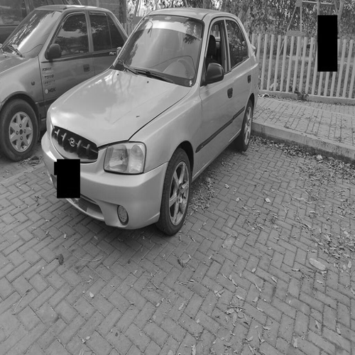
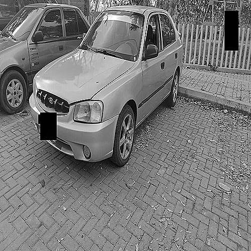
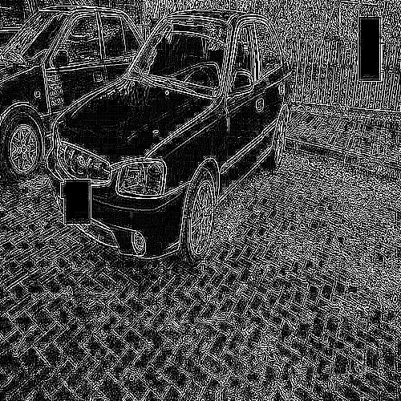
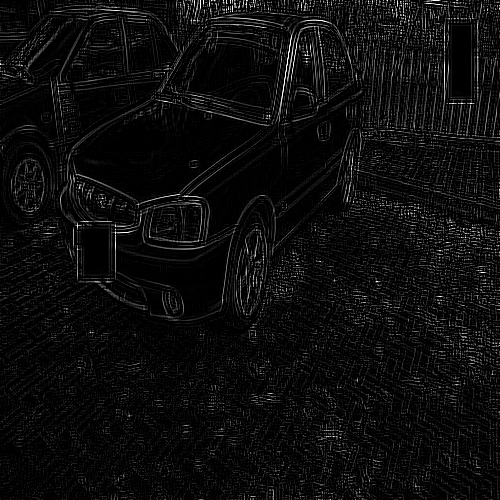

# Image Processing with Convolution Kernels

A Python project demonstrating image processing using common convolution kernels for sharpening, edge detection, and blurring effects.

## Features

- Load and prepare images (grayscale conversion, resizing)
- Apply multiple convolution kernels sequentially
- Supported operations:
  - Sharpening (enhance image details)
  - Edge detection (highlight boundaries)
  - Blurring (smoothing effect)
- Visualize each processing step
- Matrix inspection for debugging

## Example Code

### Load and prepare original image
```python
img = Images("2.jpg", target_size=(500, 500), grayscale=True) 
img.show_img((500, 500))  # Resized image for better visualization, target size is not necessarily the same as the visualization size
original_matrix = img.get_matrix(verbose=True)
```



# Apply sharpen kernel
```python
kernel_sharpen = CommonKernels.sharpen()
convoluted_sharp = Kernel(img_matrix=original_matrix, kernel_matrix=kernel_sharpen).get_result()
```
Create and show sharpened image
```python
img_sharp = img.create_from_matrix(convoluted_sharp)
img_sharp.show_img((500, 500))
```



# Apply second kernel (edge detection) over previous image

```python
kernel_edge = CommonKernels.edge_detection()
convoluted_edge = Kernel(img_matrix=convoluted_sharp, kernel_matrix=kernel_edge).get_result()
```

Create and show edge-detected image

```python
img_edge = img.create_from_matrix(convoluted_edge)
img_edge.show_img((500, 500))
```




# Apply third kernel (Box blur) over previous image
```python
print("\n=== Aplicando Kernel Blur ===")
kernel_blur = CommonKernels.blur(size=5)
```
Create and show final blurred image

```python
img_final = img.create_from_matrix(convoluted_blur)
img_final.show_img((500, 500))
```

